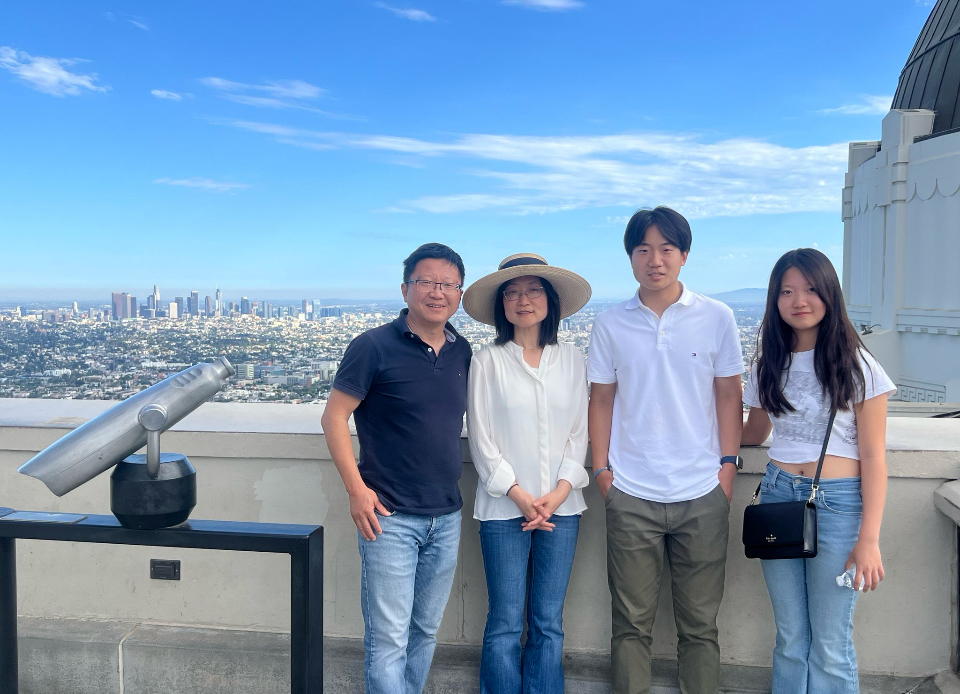
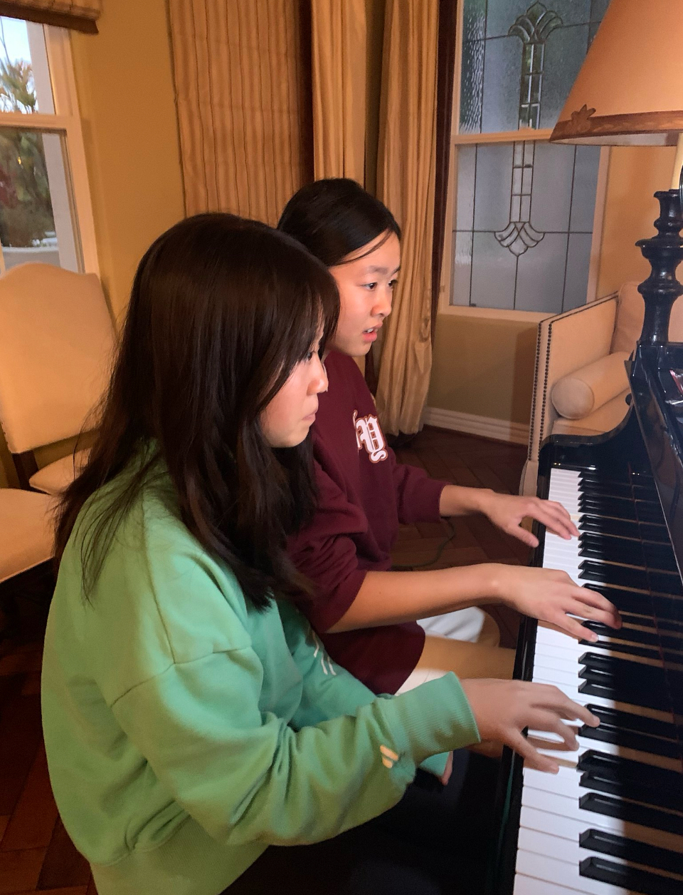
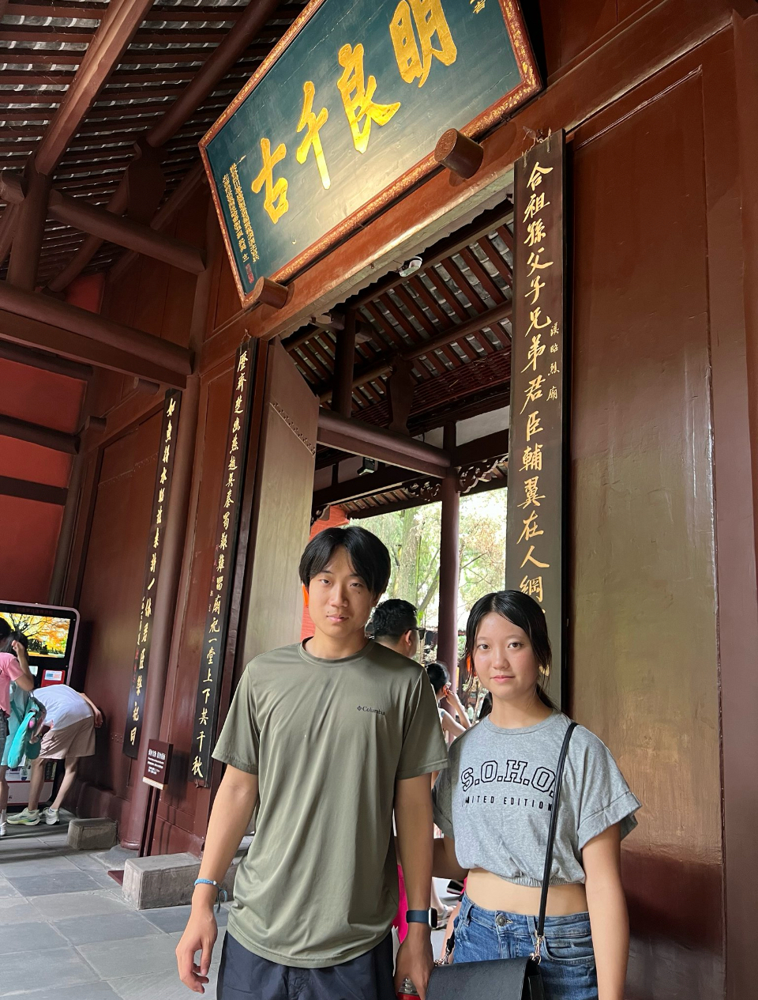

    

    

        
    
 
    

    Hi! My name is Lilian Wu and I'm currently a junior in Del Norte High School. I took CSSE last year and am now taking CSA to gain a deeper understanding about Java. In my free time, I enjoy playing tennis, playing piano, playing with my cats, cooking, and improving my skill set. I'm passionate about STEM and look forward to pursuing a career in this field, as I love learning and solving problems.

 

## My Values

    <figure>
        
        <figcaption>Family & Friends</figcaption>
    </figure>
    <figure>
        
        <figcaption>Hobbies</figcaption>
    </figure>
    <figure>
        
        <figcaption>Culture</figcaption>
    </figure>

        
        
        

